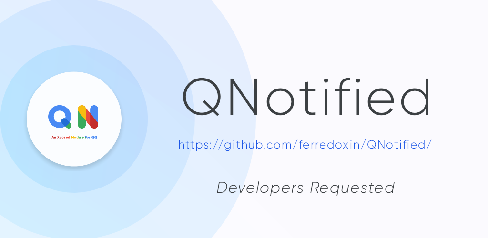

---

[](https://dev.azure.com/Cryolitia/QNotified/_build/latest?definitionId=1&branchName=master)
[](https://www.gnu.org/licenses/agpl-3.0.html)
[](https://github.com/ferredoxin/QNotified/releases/latest)

QNotified 是一个旨在使QQ变得更好用的开源Xposed模块

## QNotified

**[持续集成版本下载](https://install.appcenter.ms/orgs/qnotifieddev/apps/qnotified/distribution_groups/alpha)**

### 使用方法

激活本模块后，在QQ/TIM自带设置中点击QNotified即可开关对应功能。

## 一切开发旨在学习，请勿用于非法用途

- 本项目保证永久开源，欢迎提交PR，但是请不要提交用于非法用途的功能。
- 如果某功能被大量运用于非法用途或严重侵害插件使用者权益，那么该功能将会被移除。
- 本模块完全免费开源, 近期发现模块倒卖现象严重,请勿上当
- 鉴于项目的特殊性，开发团队可能在任何时间**停止更新**或**删除项目**

### 许可证

- [AGPL-3.0](https://www.gnu.org/licenses/agpl-3.0.html)

```
Copyright (C) 2019-2021 dmca@ioctl.cc

This program is free software: you can redistribute it and/or modify
it under the terms of the GNU Affero General Public License as
published by the Free Software Foundation, either version 3 of the
License, or (at your option) any later version.

This program is distributed in the hope that it will be useful,
but WITHOUT ANY WARRANTY; without even the implied warranty of
MERCHANTABILITY or FITNESS FOR A PARTICULAR PURPOSE.  See the
GNU Affero General Public License for more details.

You should have received a copy of the GNU Affero General Public License
along with this program.  If not, see <http://www.gnu.org/licenses/>.
```

- [EULA](./app/src/main/assets/eula.md)

```
版权所有©2021 gao_cai_sheng <qwq233@qwq2333.top, qwq2333.top>

允许在其遵守CC BY-NC-SA 4.0协议的同时，每个人复制和分发此许可证文档的逐字记录副本，且允许对其进行更改，但必须保留其版权信息与原作者。
请务必仔细阅读和理解QNotified 最终用户许可协议中规定的所有权利和限制。在使用前，您需要仔细阅读并决定接受或不接受本协议的条款。除非或直至您接受本协议的条款，否则本软件及其相关副本、相关程序代码或相关资源不得在您的任何终端上下载、安装或使用。
您一旦下载、使用本软件及其相关副本、相关程序代码或相关资源，即表示您同意接受本协议各项条款的约束。如您不同意本协议中的条款，您则应当立即删除本软件、附属资源及其相关源代码。
本软件权利只许可使用，而不出售。
本协议与GNU Affero通用公共许可证(即AGPL协议)共同作为本软件与您的协议，且本协议与AGPL协议的冲突部分均按照本协议约束。您必须同时同意并遵守本协议与AGPL协议，否则，您应立即卸载、删除本软件、附属资源及其相关源代码。
```

## 功能介绍

<details>
  <summary>目前已开发功能</summary>

1. 隐藏消息列表小程序入口
2. 去除回复自动at
3. 语音消息转发
4. 强制默认气泡
5. 以图片方式打开闪照(原辅助模块)
6. 以图片方式打开表情包(原QQ净化)
7. Ark(json)/StructMsg(xml)卡片消息(注1,原BUG复读机)
8. 复读机(+1,原QQ复读机)
9. 被删好友通知(可导出好友列表)
10. 防撤回
11. 签到文本化,隐藏礼物动画
12. 简洁模式圆头像(原花Q)
13. 自定义电量
14. 转发消息点击头像查看原消息发送者和所在群
15. 下载重定向(原QQ净化)
16. 屏蔽 \@全体成员 或者 群红包 的通知(不影响接收消息,不影响某些插件抢红包功能)
17. 屏蔽QQ更新提示
18. 屏蔽QQ空间点赞通知
19. 禁止聊天界面输入＄自动弹出 选择赠送对象 窗口
20. 直接打开不可通过QQ号码搜索到用户的资料卡
21. 屏蔽秀图
22. 显示进行禁言操作的管理员(查看哪个管理员禁言了你)
23. 去除夜间模式聊天界面深色遮罩
24. 直接打开指定用户资料卡(无视隐藏QQ号)
25. 自定义+1图标
26. 群发文本消息(注1)
27. 显示具体消息数量而不是99+(原花Q)
28. 隐藏侧滑群应用
29. 隐藏好友侧滑亲密抽屉
30. 使用系统相机
31. 使用系统相册
32. 使用系统文件
33. 聊天自动发送原图
34. 隐藏小红点
35. 隐藏群在线人数
36. 隐藏群总人数
37. 批量撤回消息
38. 隐藏移出群助手提示
39. 修改消息左滑回复
40. at界面以管理员优先顺序排序
41. 自动续火
42. 静默指定类型通知
43. 聊天字数统计
44. 自定义钱包显示余额
45. 显示消息发送者QQ号与时间
46. 聊天自动发送/接收原图

注1: 卡片消息及群发文本这两个功能因大量被用于广告引流而被加以限制

</details>

### [计划或正在开发的功能](https://github.com/ferredoxin/QNotified/projects/2)

### 不会支持的功能

- 抢红包
- 群发图片或其他类型消息

## 开始

- [CONTRIBUTING](CONTRIBUTING.md)

## 赞助

- 由于项目的特殊性，我们不接受任何形式的捐赠，但是我们希望有更多的人能够参与本项目的开发

## [QNotified最终用户许可协议](./app/src/main/assets/eula.txt)
